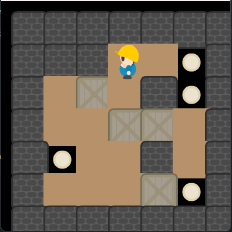

# 🕹️ Sokuban-Itec 🎮

### Welcome to Sokuban-Itec: A Challenging Puzzle Game! 🧩

Dive into the world of Sokuban-Itec, where brain-teasing puzzles await your strategic mind. Explore the intricacies of each level, maneuvering through obstacles with precision and wit.

🔍 **Explore the Features:**
- Engaging gameplay that sharpens your problem-solving skills.
- Intuitive controls for a seamless gaming experience.
- Unique and progressively challenging levels to keep you hooked.
- Immerse yourself in the minimalist yet captivating design.

🚀 **Getting Started:**
1. Clone this repository.
2. Open the game in your preferred environment.
3. Begin your Sokuban-Itec adventure!

📖 **Read the Documentation:**
For in-depth instructions and game mechanics, check out our detailed documentation [here](documentation.md).

🤝 **Contribution Guidelines:**
We welcome contributions! If you'd like to enhance Sokuban-Itec, please read our [contribution guidelines](CONTRIBUTING.md).

📷 **Screenshots:**

📑 **License:**
This project is licensed under the MIT License - see the [LICENSE](LICENSE) file for details.

🌐 **Connect with Us:**
- Email: d2f.working@gmail.com 
